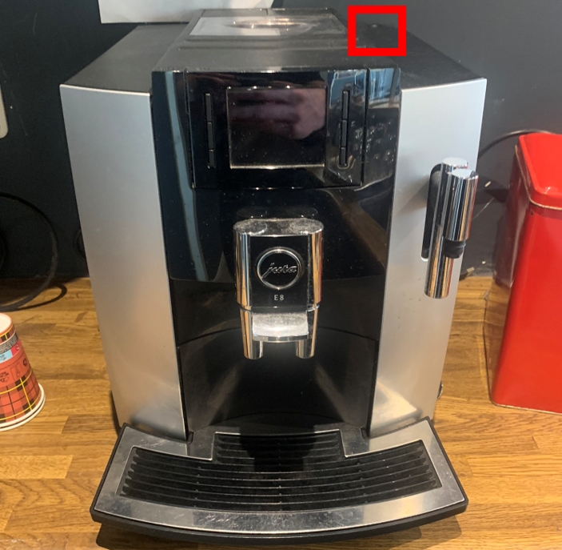
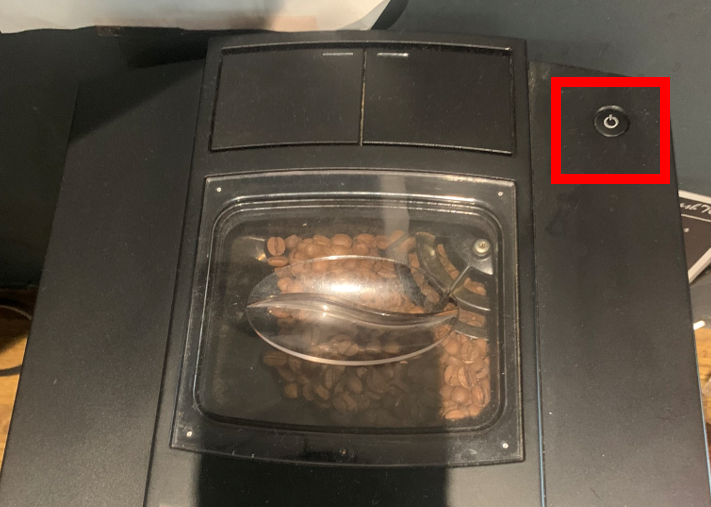

.. _bonen:

Koffiemachine - bonen
#######################

De bonenmachine wordt bij voorkeur zoveel mogelijk gebruikt om koffie voor gasten te zetten. 

Koffie zetten
*********************

1. Druk op de knop bovenop het apparaat om de machine in te schakelen. Machine zal dan gaan

2. Druk op de  voor :

.. image:: media/image7.png

3. Druk op de **groene knop** :

.. image:: media/image8.png

4. Klant kan pas op de klantterminal leggen of onderin invoeren. Bij een geslaagde transactie komt er een bon uit de barterminal.

.. image:: media/image9.png

Water bijvullen
******************

Open het klepje aan de bovenzijde en til de waterbak eruit:

.. image:: media/water.gif

Afvalbak legen
******************

