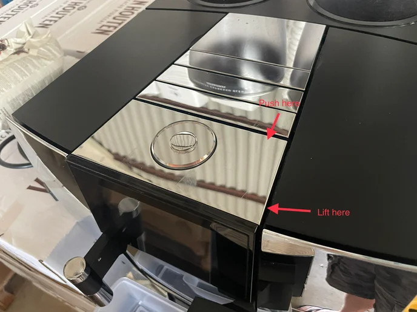
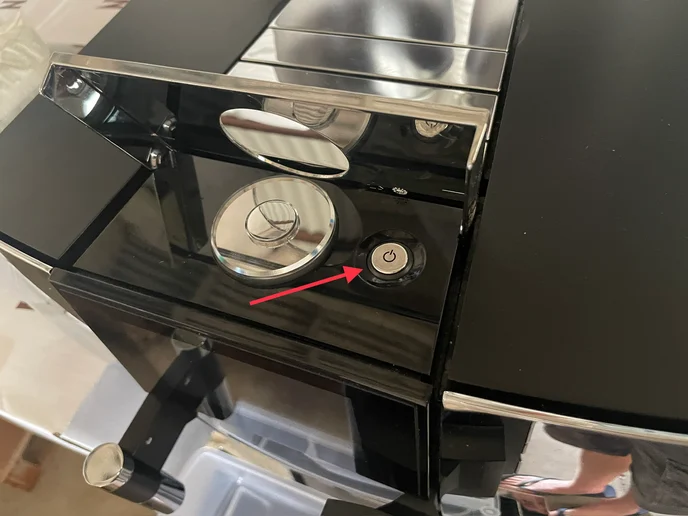

.. _bonen:

Koffiemachine - bonen
#######################

De bonenmachine wordt bij voorkeur zoveel mogelijk gebruikt om koffie voor gasten te zetten. 

Koffie zetten
*********************

1. Open het klepje en druk op de aan/uitknop om de machine in te schakelen

Water bijvullen
******************

Open het klepje aan de bovenzijde en til de waterbak eruit:

Afvalbak legen
******************

