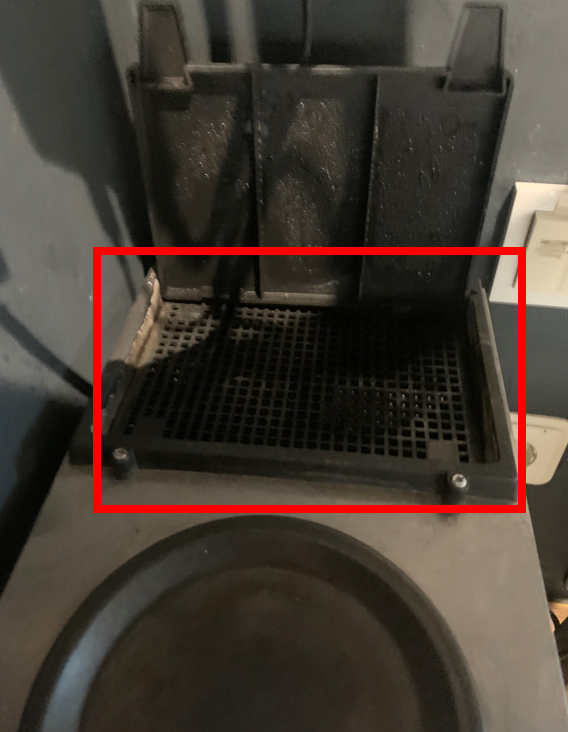
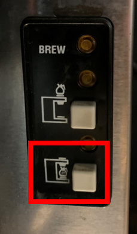
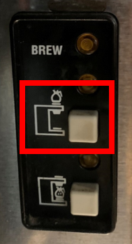

.. _filtermachine:

Koffiemachine - filter
#######################

De filtermachine wordt gebruikt in de uitzonderlijke situatie dat de bonenmachine niet toereikend wordt geacht. 

Koffie zetten
*********************

1. Meet **12 kopjes** water af in de koffiekan en gooi dit **voorzichtig** in het reservoir bovenop het apparaat.

2. Plaats een koffiefilter in de houder en meet **één kartonnen bekertje** koffie af. Beiden staan in de keuken, kastje rechtsboven.

.. image:: media/filter2.PNG

3. Druk op de onderste knop om koffie te zetten:

 

Koffie warmhouden
******************

Om een gezette kan warm te houden kan er gebruik worden gemaakt van het warmhoudplateau bovenop het apparaat. Plaats de **gevulde** kan op het warmhoudplateau en schakel de bovenste knop in:

