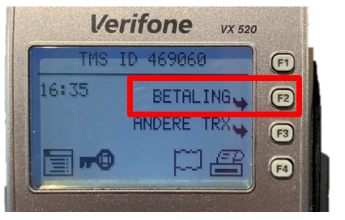
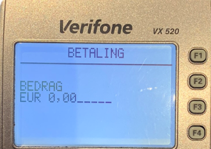
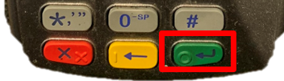

.. _pin:

Pinapparaat
#######################

Het pinapparaat wordt bij voorkeur gebruikt om elke betaling aan de bar direct af te handelen. Hieronder staat een korte handleiding om een transactie uit te voeren en de bonrol te verwisselen.

Pintransactie starten
*********************

1. Druk op de knop **F2 - BETALING**.

2. Voer het bedrag in **centen** in, 1 euro wordt 100:

3. Druk op de **groene knop** :

4. Klant kan pas op de klantterminal leggen of onderin invoeren. Bij een geslaagde transactie komt er een bon uit de barterminal.

Bonrol verwisselen
******************

Open het klepje aan de bovenzijde, verwijder het oude plastic rolletje en doe er een nieuwe in. Liggen in rechter keukenlade:

.. image:: media/bonrol.gif