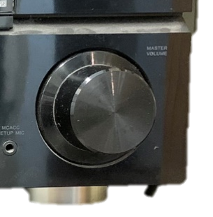
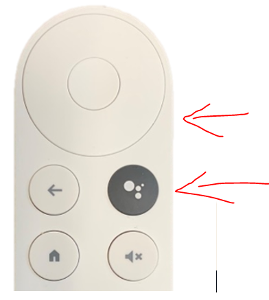

===============
Handleiding Beeld en Geluid TTV Smash ‘70\
===============

.. image:: media/image1.png
1. Versterker, staat in de keuken
.. image:: media/image2.png
.. image:: media/image3.png
.. image:: media/image4.png
.. image:: media/image5.png

.. _section-1:

1. Versterker, staat in de keuken

2. Afstandsbediening Beamer

3. Afstandsbediening Chromecast

4. Afstandsbediening Beamerscherm

5. Afstandsbediening TV

Ik wil muziek luisteren
=======================

1. Versterker(1) inschakelen met de aan/uit knop.

.. image:: media/image6.png
   :width: 800

2. Zorg dat de bron op TV/Sat staat, draaien aan de **linker** draaiknop
   totdat TV/Sat in beeld staat:

.. image:: media/image7.png
   :alt: Afbeelding met Huishoudelijk apparaat, keukenapparaat,
   Apparaatje, machine Automatisch gegenereerde beschrijving
   :width: 2.63542in
   :height: 2.47917in

3. Chromecast wakker maken met afstandsbediening 3, druk op de middelste
   knop:

.. image:: media/image8.png
   :alt: Afbeelding met cirkel, ontwerp Automatisch gegenereerde
   beschrijving
   :width: 2.89583in
   :height: 2.33297in

4. Televisie inschakelen met afstandsbediening 5, druk op de rode knop
   en richt op de TV:

.. image:: media/image9.png
   :alt: Afbeelding met tekst, Elektronisch apparaat, rekenmachine
   Automatisch gegenereerde beschrijving
   :width: 2.60592in
   :height: 1.89281in

5. Zorg dat de televisie op HDMI 1 staat, middels de SOURCE-knop op
   afstandsbediening 5:

.. image:: media/image9.png
   :alt: Afbeelding met tekst, Elektronisch apparaat, rekenmachine
   Automatisch gegenereerde beschrijving
   :width: 2.58113in
   :height: 1.8748in

6. Druk op de afstandsbediening op de HOME-knop en selecteer vervolgens
   de app SPOTIFY. De ronde bovenste knoppen fungeren als pijltjes.
   Bevestigen is de middelste knop:

..

   .. image:: media/image10.png
      :alt: Afbeelding met cirkel, afstandsbediening, ontwerp
      Automatisch gegenereerde beschrijving
      :width: 1.54839in
      :height: 2.00983in

7. Kies de gewenste afspeellijst, artiest etc.

8. Volume wordt geregeld met de rechter draaiknop op de versterker óf
   met de knoppen aan de rechterzijkant van afstandsbediening 3.

|Afbeelding met Huishoudelijk apparaat, keukenapparaat, Apparaatje,
camera Automatisch gegenereerde beschrijving|\ |Afbeelding met cirkel,
schermopname, ontwerp Automatisch gegenereerde beschrijving|

Ik wil TV kijken
================

1. Versterker(1) inschakelen met de aan/uit knop.

.. image:: media/image6.png
   :alt: Afbeelding met tekst, gadget, elektronica, Elektronisch
   apparaat Automatisch gegenereerde beschrijving
   :width: 2.90625in
   :height: 3.20833in

2. Zorg dat de bron op TV/Sat staat, draaien aan de **linker** draaiknop
   totdat TV/Sat in beeld staat:

.. image:: media/image7.png
   :alt: Afbeelding met Huishoudelijk apparaat, keukenapparaat,
   Apparaatje, machine Automatisch gegenereerde beschrijving
   :width: 2.63542in
   :height: 2.47917in

3. Chromecast wakker maken met afstandsbediening 3, druk op de middelste
   knop:

.. image:: media/image8.png
   :alt: Afbeelding met cirkel, ontwerp Automatisch gegenereerde
   beschrijving
   :width: 2.89583in
   :height: 2.33297in

4. Televisie inschakelen met afstandsbediening 5, druk op de rode knop
   en richt op de TV:

.. image:: media/image9.png
   :alt: Afbeelding met tekst, Elektronisch apparaat, rekenmachine
   Automatisch gegenereerde beschrijving
   :width: 2.60592in
   :height: 1.89281in

5. Zorg dat de televisie op HDMI 1 staat, middels de SOURCE-knop op
   afstandsbediening 5:

.. image:: media/image9.png
   :alt: Afbeelding met tekst, Elektronisch apparaat, rekenmachine
   Automatisch gegenereerde beschrijving
   :width: 2.58113in
   :height: 1.8748in

6. Druk op de afstandsbediening op de HOME-knop en selecteer vervolgens
   de app **TIVIMATE**. De ronde bovenste knoppen fungeren als pijltjes.
   Bevestigen is de middelste knop:

..

   .. image:: media/image10.png
      :alt: Afbeelding met cirkel, afstandsbediening, ontwerp
      Automatisch gegenereerde beschrijving
      :width: 1.54839in
      :height: 2.00983in

7. Kies de gewenste afspeellijst, artiest etc.

8. Volume wordt geregeld met de rechter draaiknop op de versterker óf
   met de knoppen aan de rechterzijkant van afstandsbediening 3.

|Afbeelding met Huishoudelijk apparaat, keukenapparaat, Apparaatje,
camera Automatisch gegenereerde beschrijving|\ |Afbeelding met cirkel,
schermopname, ontwerp Automatisch gegenereerde beschrijving|

9. Indien ook de Beamer gewenst is, om het scherm naar beneden te laten
   zakken, druk 1 maal op DOWN op afstandsbediening 4. Let op, het
   scherm stopt vanzelf op de juiste hoogte!

..

   .. image:: media/image13.png
      :alt: Afbeelding met tekst, ontwerp Automatisch gegenereerde
      beschrijving
      :width: 1.53125in
      :height: 2.21875in

10. Schakel de beamer in met afstandsbediening 2, druk op de ON knop
    terwijl je **onder** de beamer staat en omhoog mikt.

.. image:: media/image14.png
   :alt: Afbeelding met tekst, Gamecontroller, controle Automatisch
   gegenereerde beschrijving
   :width: 1.63542in
   :height: 1.0625in

11. Zorg dat de beamer op HDMI 1 staat met afstandsbediening 2:

.. image:: media/image15.png
   :alt: Afbeelding met tekst, Elektronisch apparaat, elektronica,
   controle Automatisch gegenereerde beschrijving
   :width: 1.39583in
   :height: 1.04167in

.. |image1| image:: media/image1.png
   :width: 6.06944in
   :height: 2.1875in
.. |Afbeelding met afstandsbediening, op afstand, tekst, controle Automatisch gegenereerde beschrijving| image:: media/image2.png
   :width: 1.16708in
   :height: 3.125in
.. |Afbeelding met elektronica, afstandsbediening, op afstand, Elektronisch apparaat Automatisch gegenereerde beschrijving| image:: media/image3.png
   :width: 1.31177in
   :height: 3.57639in
.. |Afbeelding met tekst, Materiaaleigenschap, op afstand, overdekt Automatisch gegenereerde beschrijving| image:: media/image4.png
   :width: 1.34447in
   :height: 3.06944in
.. |Afbeelding met tekst, afstandsbediening, controle, overdekt Automatisch gegenereerde beschrijving| image:: media/image5.png
   :width: 4.09866in
   :height: 1.41462in

