Ik wil muziek luisteren
=======================

1. Versterker(1) inschakelen met de aan/uit knop.

2. Zorg dat de bron op TV/Sat staat, draaien aan de **linker** draaiknop
   totdat TV/Sat in beeld staat:

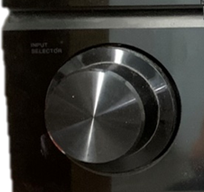

3. Chromecast wakker maken met afstandsbediening 3, druk op de middelste
   knop:

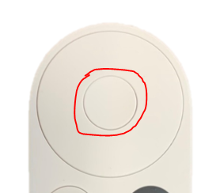

4. Televisie inschakelen met afstandsbediening 5, druk op de rode knop
   en richt op de TV:

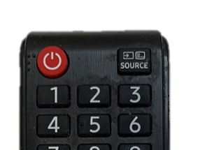

5. Zorg dat de televisie op HDMI 1 staat, middels de SOURCE-knop op
   afstandsbediening 5:

6. Druk op de afstandsbediening op de HOME-knop en selecteer vervolgens
   de app SPOTIFY. De ronde bovenste knoppen fungeren als pijltjes.
   Bevestigen is de middelste knop:

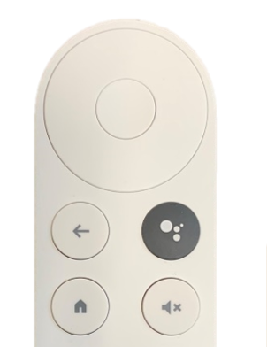

7. Kies de gewenste afspeellijst, artiest etc.

8. Volume wordt geregeld met de rechter draaiknop op de versterker óf
   met de knoppen aan de rechterzijkant van afstandsbediening 3.
   
   .. image:: media/image11.png 

   .. image:: media/image12.png

Ik wil TV kijken
================

1. Versterker(1) inschakelen met de aan/uit knop.

2. Zorg dat de bron op TV/Sat staat, draaien aan de **linker** draaiknop
   totdat TV/Sat in beeld staat:

3. Chromecast wakker maken met afstandsbediening 3, druk op de middelste
   knop:

4. Televisie inschakelen met afstandsbediening 5, druk op de rode knop
   en richt op de TV:

5. Zorg dat de televisie op HDMI 1 staat, middels de SOURCE-knop op
   afstandsbediening 5:

6. Druk op de afstandsbediening op de HOME-knop en selecteer vervolgens
   de app **TIVIMATE**. De ronde bovenste knoppen fungeren als pijltjes.
   Bevestigen is de middelste knop:

7. Kies de gewenste afspeellijst, artiest etc.

8. Volume wordt geregeld met de rechter draaiknop op de versterker óf
   met de knoppen aan de rechterzijkant van afstandsbediening 3.

   .. image:: media/image11.png
   .. image:: media/image12.png

9. Indien ook de Beamer gewenst is, om het scherm naar beneden te laten
   zakken, druk 1 maal op DOWN op afstandsbediening 4. Let op, het
   scherm stopt vanzelf op de juiste hoogte!

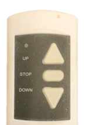

10. Schakel de beamer in met afstandsbediening 2, druk op de ON knop
    terwijl je **onder** de beamer staat en omhoog mikt.

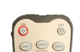

11. Zorg dat de beamer op HDMI 1 staat met afstandsbediening 2:

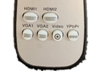

Apparaten en afstandsbedieningen
================

1. Versterker, staat in de keuken

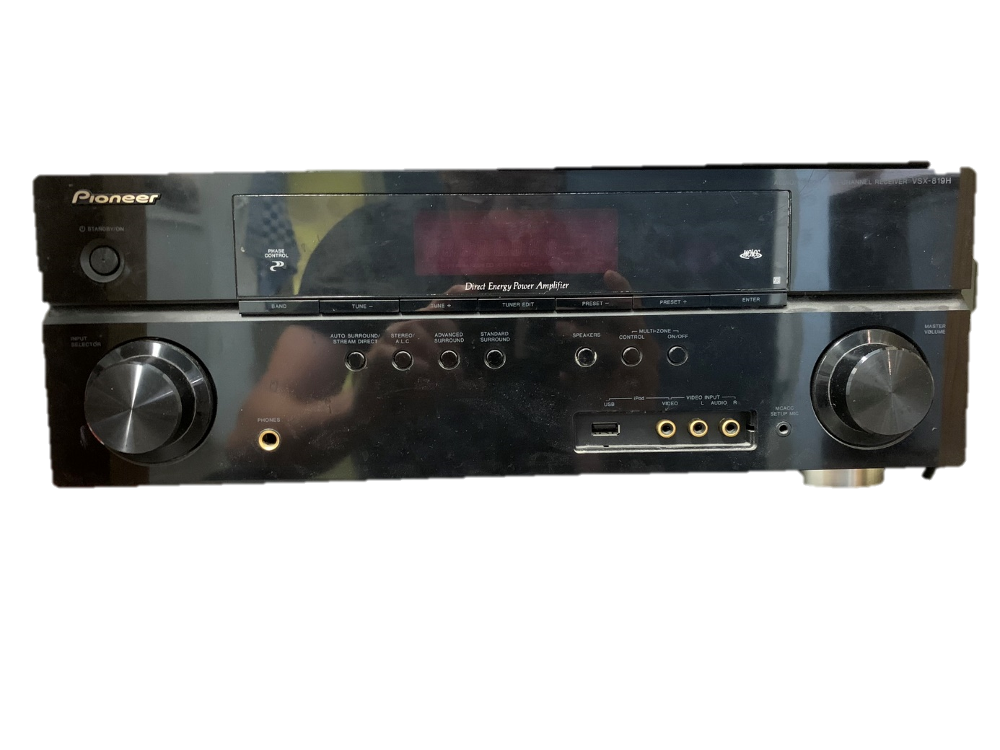

2. Afstandsbediening Beamer

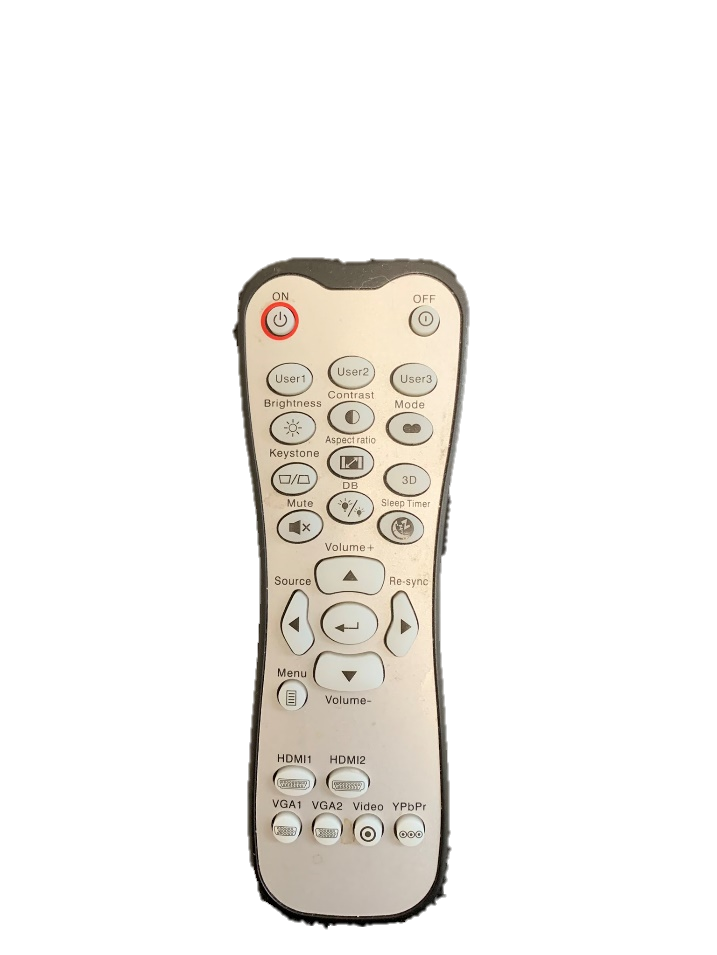

3. Afstandsbediening Chromecast

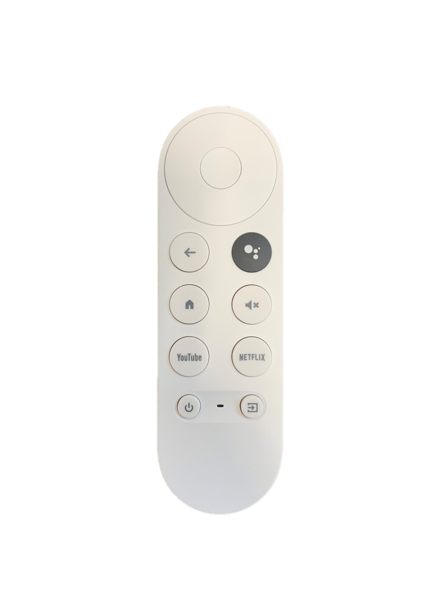

4. Afstandsbediening Beamerscherm

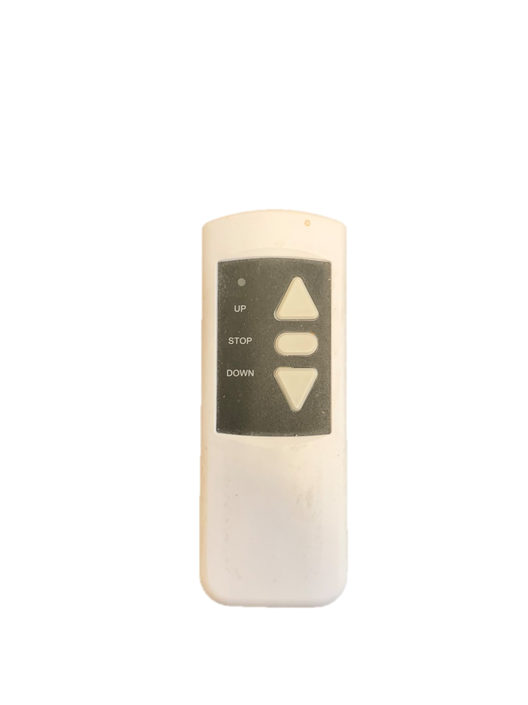

5. Afstandsbediening TV

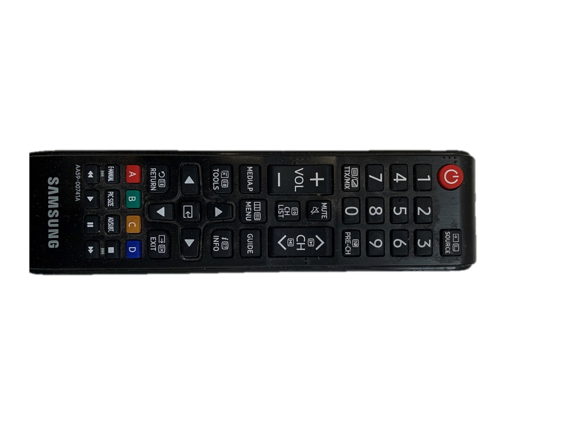

