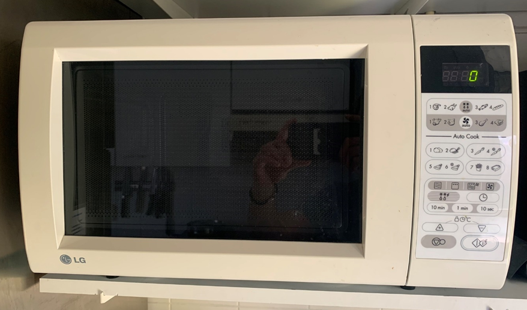
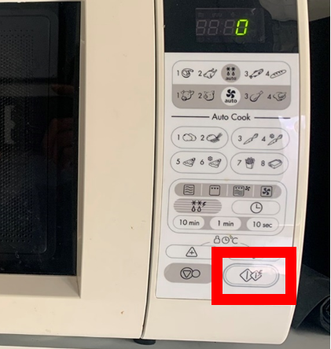

.. _magnetron:

Magnetron
#########

De magnetron wordt gebruikt om verschillende snacks warm te maken of te ontdooien:

Magnetron gebruiken
*********************

1. Open het deurtje en leg het te verwarmen/ontdooien product op het glazen plateau.

2. Druk op onderstaande knop om de magnetron 30 seconden in te schakelen. Elke druk op de knop laat de tijd met 30 seconden oplopen.

