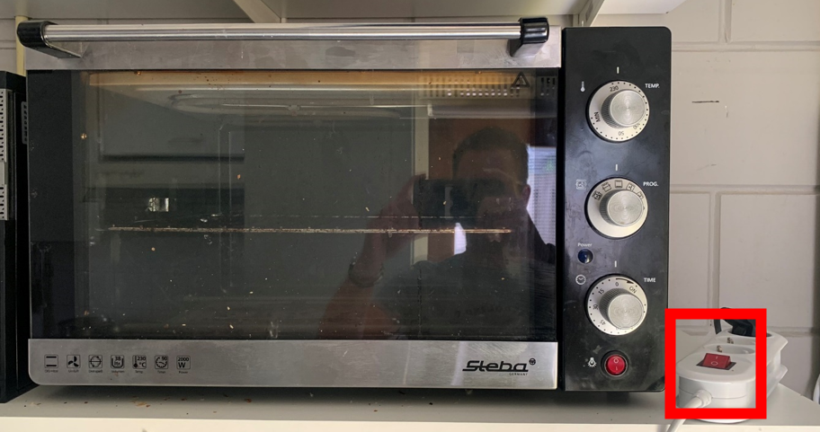
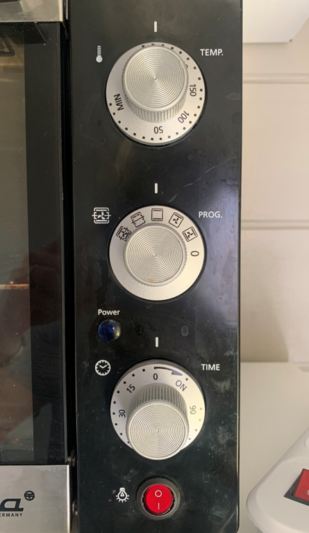

.. _oven:

Oven
#########

De oven wordt gebruikt om broodjes e.d. af te bakken.

Oven gebruiken
*********************

1. Zet de schakelaar op de stekkerdoos om.

2. Stel het gewenste programma, temperatuur en tijd in:

.. warning::
   Schakel de oven na gebruik uit met de knop op de stekkerdoos, de rode knop op de oven zelf is **niet** van de oven maar alleen van het lampje.

