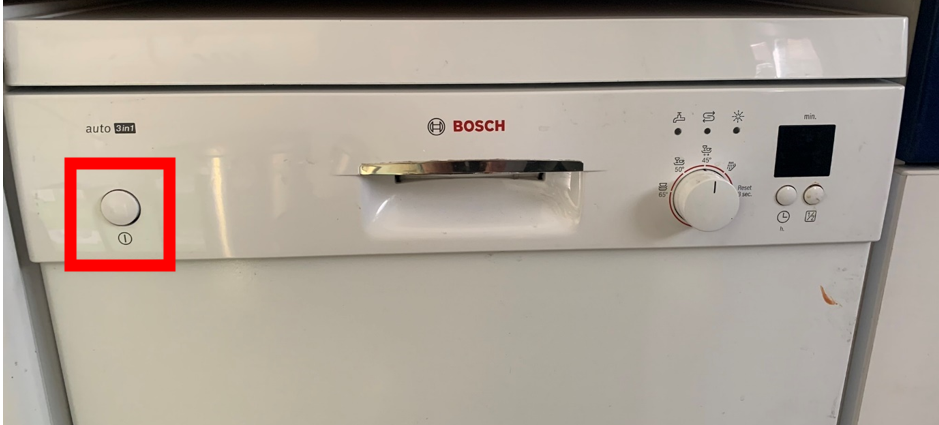
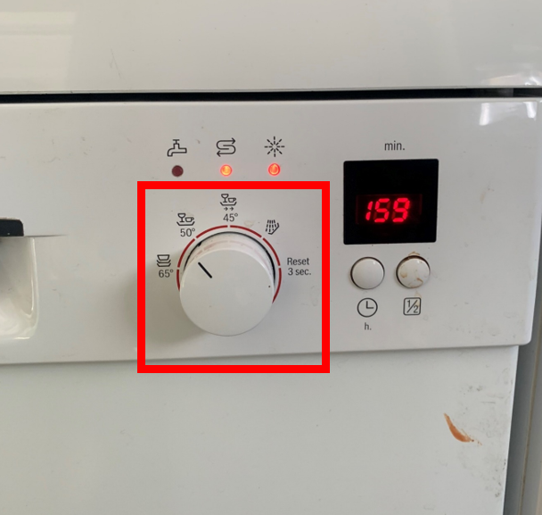

.. _vaatwasser:

Vaatwasser
#######################

Afwassen is niet nodig, maar we vinden het wel fijn als je de vaatwasser aanzet als deze vol is.

Vaatwasser starten
*********************

1. Druk op de knop **Aan-uit**.

2. Stel het programma in op **50 graden** en sluit de deur **goed**. Het programma zal dan automatich starten.

