.. _tv:

Laptop naar beamer
################

1. Versterker(1) inschakelen met de aan/uit knop.

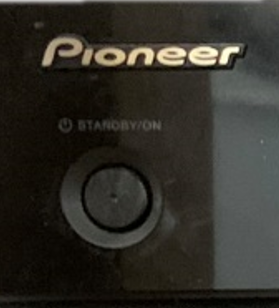

2. Zorg dat de bron op TV/Sat staat, draaien aan de **linker** draaiknop
   totdat TV/Sat in beeld staat:

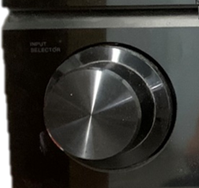

3. Chromecast wakker maken met afstandsbediening 3, druk op de middelste
   knop:

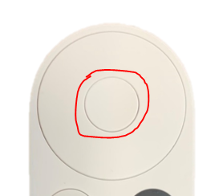

4. Televisie inschakelen met afstandsbediening 3, druk op aan-knop
   en richt op de TV:

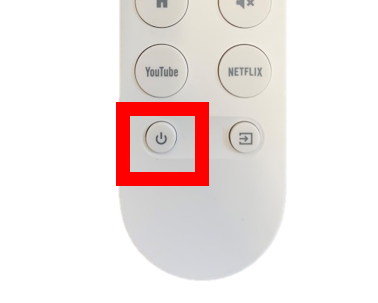

5. Zorg dat de televisie op HDMI 1 staat, middels de SOURCE-knop op
   afstandsbediening 3, meerdere keren drukken verandert het kanaal:

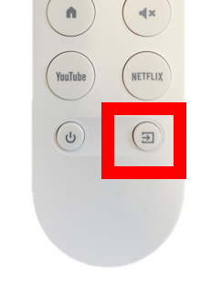

9. Om het scherm naar beneden te laten zakken, druk 1 maal op DOWN op afstandsbediening 4. Let op, het
   scherm stopt vanzelf op de juiste hoogte!

10. Schakel de beamer in met afstandsbediening 2, druk op de ON knop
    terwijl je **onder** de beamer staat en omhoog mikt.

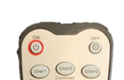

11. Zorg dat de beamer op HDMI 1 staat met afstandsbediening 2:

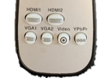

12. Verbind de laptop met wifi **TTVSMASH70**, wachtwoord staat op de muur achter de beamer

13. Open Chrome op de laptop en klik op de 3 puntjes rechtsboven:

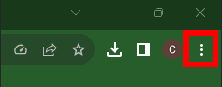

13. Selecteer casten:

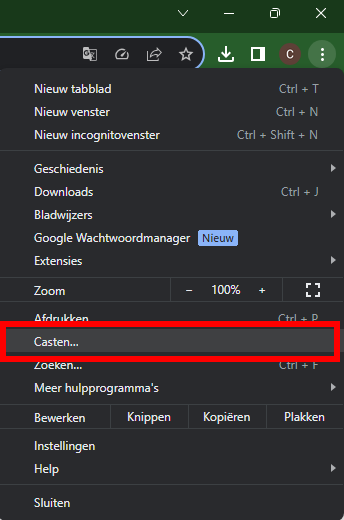

13. Klik op bronnen en selecteer Scherm casten:

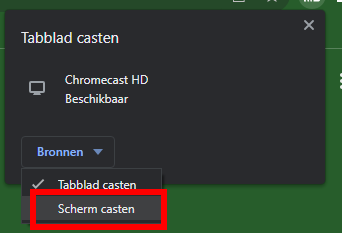

14. Klik op Chromecast HD, het scherm wordt nu gedupliceerd op de beamer en het geluid gaat over de speakers.

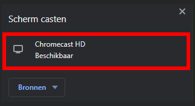