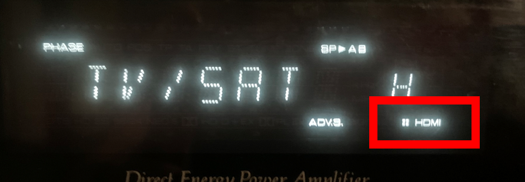
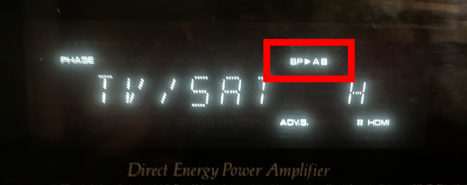
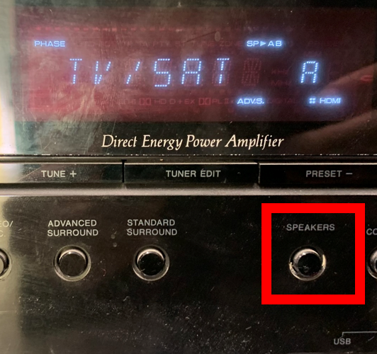

.. _problemen:

Problemen
#######################

Oké, je hebt de gebruiksaanwijzing gevolgd en toch heb je geen beeld en/of geluid. Hieronder een aantal mogelijke problemen:

Geen beeld
**********

Heb je geen beeld op de tv? Controleer dan of de versterker op kanaal TV/SAT staat en de TV op HDMI1.
Is dat zo? Controleer dan of het HDMI logo op het display van de versterker brandt en **niet** knippert. 

Knippert deze? Maak dan de Chromecast 'wakker' door op één van de bovenste knoppen te drukken.

Geen geluid
***********

Controleer of het volume op de versterker (>40) en de tv (>20) hoog genoeg staat. De versterker bedien je door te draaien aan de rechter draaiknop, de TV door op de witte afstandsbediening de knoppen aan de rechterzijkant te gebruiken.
Staat het volume hard genoeg? Controleer dan of speakers ingeschakeld zijn, op het display moet bovenin SP->AB staan. 

Is dit niet zo? Druk dan op de knop **SPEAKERS** onder het display, net zo lang tot AB in beeld staat.

Nog geen geluid? Controleer dan of de stand **STEREO** is ingeschakeld, druk meermaals op de knop **STEREO** totdat **STEREO** in beeld staat.

